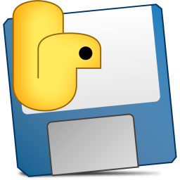

# 3Go — YouTube Video & Playlist Downloader



Free desktop app to download YouTube videos and playlists.  
Built with **PySide6** + **yt-dlp** + **ffmpeg**.

## Features

- Download single videos or entire playlists
- Choose quality: 4K / 1080p / 720p / 480p / 360p / Audio only
- Playlist auto-detection with checkbox selection
- Numbered files for playlists (01 - Title.mp4)
- ENG / UKR language switcher
- Dark glassmorphism UI
- Retry & timeout resilience

## Download

Go to [Releases](../../releases) and download **3Go.exe** — just run it, no install needed.

### Requirements

- **Windows 10/11**
- **[ffmpeg](https://ffmpeg.org/download.html)** — must be installed or placed next to 3Go.exe
- **[Node.js](https://nodejs.org/)** — required for yt-dlp JS runtime

## Development

```bash
# Create virtual environment
python -m venv .venv

# Activate
.venv\Scripts\activate

# Install dependencies
pip install PySide6 yt-dlp

# Run
python main.py

# Build exe
pip install pyinstaller
pyinstaller 3Go.spec --clean --noconfirm
# Output: dist/3Go.exe
```

## License

MIT
